# Manual Técnico del Sistema de Nómina y RRHH

## Introducción

El presente documento tiene como objetivo describir de forma técnica, estructurada y detallada la configuración, arquitectura, dependencias y procedimientos de instalación del *Sistema de Nómina y Gestión de Recursos Humanos*. Este sistema fue desarrollado utilizando tecnologías modernas basadas en **Node.js, Express, React, Vite y SQL Server**, y se encuentra desplegado en un entorno **IIS (Internet Information Services)**.

El manual está orientado a desarrolladores, administradores de sistemas y personal técnico que requieran comprender la estructura interna, la configuración de los componentes y las buenas prácticas de mantenimiento del sistema.

---

## Propósito

Este manual técnico describe los procedimientos, dependencias y configuraciones necesarias para instalar, ejecutar y mantener el sistema de nómina. También documenta la arquitectura general, los flujos de comunicación entre frontend, API REST y base de datos, así como las consideraciones de seguridad y mantenimiento preventivo.

---

## Alcance

El sistema permite la **administración completa del recurso humano** de una organización, incluyendo:

* Registro y gestión de empleados.
* Mantenimiento de departamentos y puestos.
* Procesamiento automático de nóminas con cálculo de bonificaciones y deducciones.
* Generación de reportes en formato PDF y exportaciones de datos.
* Control de acceso por roles con **JWT (Administrador, RRHH, Empleado)**.

---

## Requerimientos del Sistema

**Hardware mínimo recomendado:**

* Procesador: Intel Core i5 o superior.
* Memoria RAM: 8 GB.
* Almacenamiento: 10 GB libres.

**Software necesario:**

* Node.js 20.x o superior.
* npm 10.x o superior.
* TypeScript 5.x.
* React 18 + Vite.
* SQL Server 2019 o superior.
* SQL Server Management Studio (SSMS).
* Visual Studio Code o IDE equivalente.
* Navegador moderno (Chrome, Edge o Firefox).

---

## Dependencias del Sistema

El sistema utiliza librerías modernas para garantizar escalabilidad, mantenibilidad y rendimiento:

* **Frameworks:** React 18 + Vite (frontend) / Node.js + Express (backend).
* **Lenguaje:** TypeScript 5.x (tipado estático).
* **Estilos:** TailwindCSS 4.x (diseño responsivo y moderno).
* **Gestor de estado:** React Query + Zustand.
* **Validación de formularios:** React Hook Form + Zod.
* **HTTP:** Axios con interceptores JWT.
* **Autenticación:** JSON Web Tokens (JWT).
* **Reportes:** jsPDF y pdfmake.

---

## Arquitectura General

```text
Frontend (React + Vite)
       ↓
API REST (Node.js / Express)
       ↓
Base de Datos (SQL Server)
```

**Flujo de operación:**

1. El usuario interactúa con el **frontend React**.
2. Las solicitudes son enviadas a la **API REST** mediante Axios.
3. El **backend Node.js** procesa las peticiones y consulta la base de datos SQL Server.
4. Los resultados son devueltos al frontend para ser mostrados al usuario.

---

## Componentes del Sistema

### Frontend

* **Lenguaje:** TypeScript 5.
* **Framework:** React + Vite.
* **Estilos:** TailwindCSS.
* **Estado:** React Query + Zustand.
* **Validación:** react-hook-form + Zod.
* **Reportes:** jsPDF / pdfmake.

### Backend

* **Lenguaje:** TypeScript.
* **Framework:** Node.js + Express.
* **Autenticación:** JWT.
* **ORM:** Sequelize / Prisma (para SQL Server).
* **Documentación:** Swagger UI.

---

## Instalación y Configuración

### 1️⃣ Instalación del Backend

```bash
cd api-nomina-rh
npm install
npm run build
```

### 2️⃣ Restauración de la Base de Datos

1. Abrir **SQL Server Management Studio (SSMS)**.
2. Clic derecho en *Bases de datos → Restaurar base de datos…*
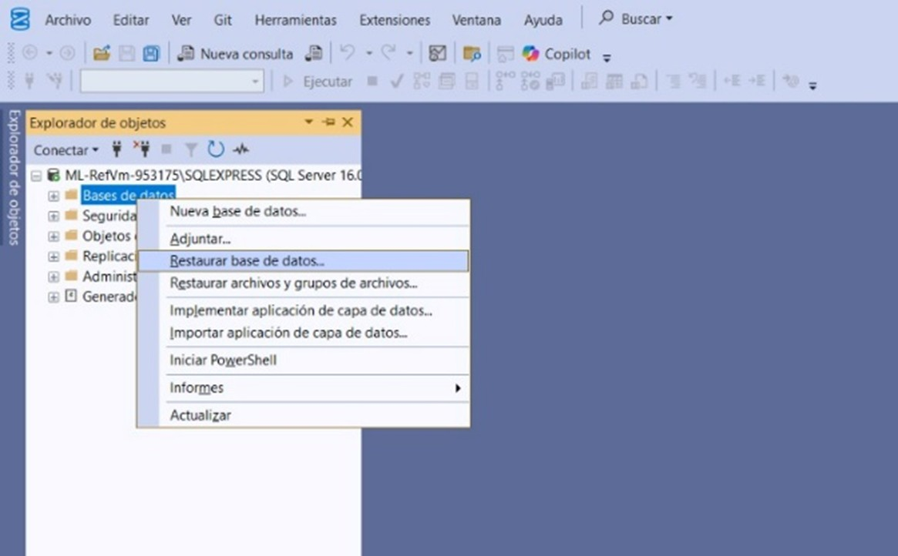
3. Seleccionar **Dispositivo** y ubicar `C:\bck\dbnomina.bak`.
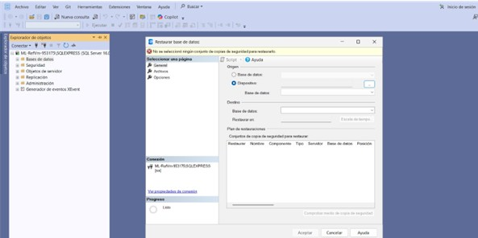
4. Asignar nombre **db_nomina** y ejecutar la restauración.
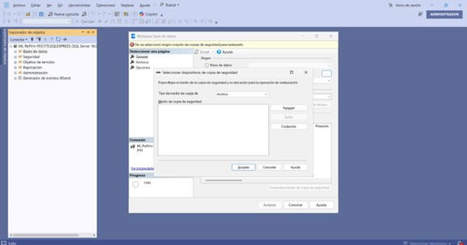
5. Confirmar mensaje de restauración exitosa.
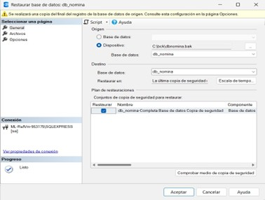
### 3️⃣ Configuración del Archivo `.env`

```bash
DB_SERVER=LAPTOP-VOGUL89I\SQLEXPRESS
DB_NAME=db_nomina
DB_USER=sa
DB_PASSWORD=12345
DB_PORT=1433
JWT_SECRET=clave_secreta_segura
CORS_ORIGIN=http://localhost:8081
```

### 4️⃣ Publicación en IIS (Backend)

1. Instalar **iisnode** (`iisnode-full-v0.2.26-x64.msi`).
2. Instalar **NSSM (Non-Sucking Service Manager)**.
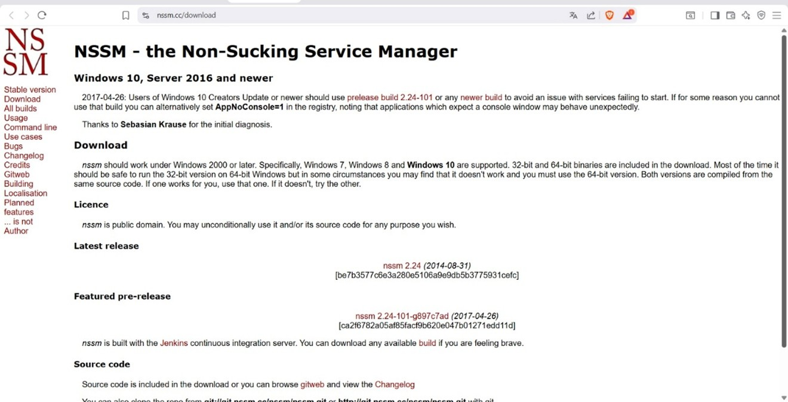
3. Crear carpeta `C:\inetpub\api-nomina-rh`.
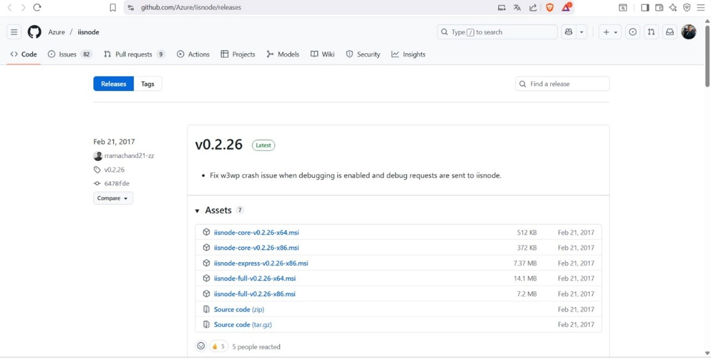
4. Copiar los archivos compilados (`/dist`) y `web.config`.
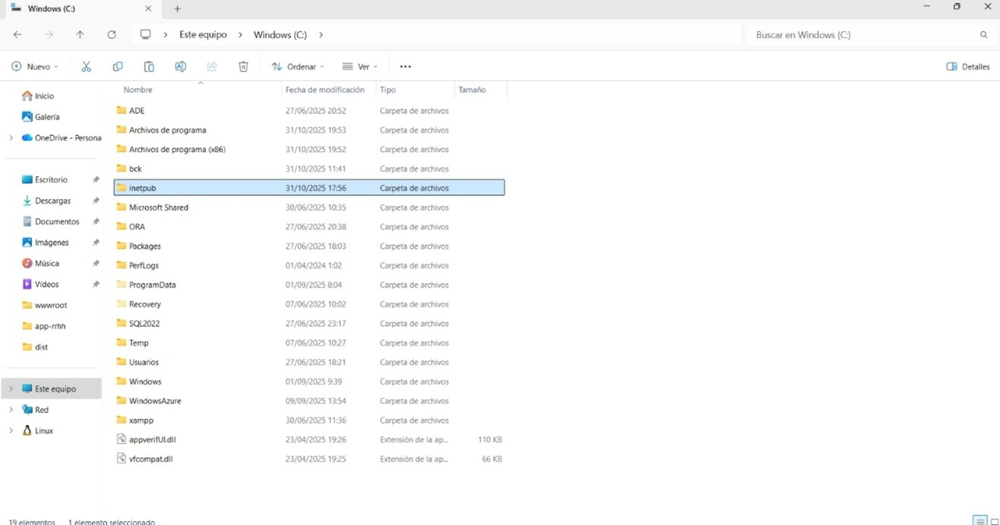
5. En IIS → Agregar sitio web → Ruta física: `C:\inetpub\api-nomina-rh`, puerto `8080`.
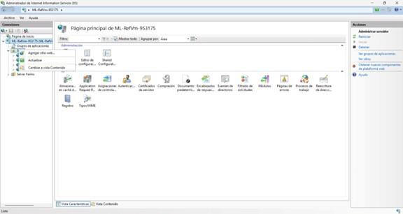
6. Comprobar que Swagger UI esté disponible en `http://localhost:8080/api-docs`.


**Ejemplo de `web.config` del backend:**

```xml
<configuration>
  <system.webServer>
    <handlers>
      <add name="iisnode" path="dist/main.js" verb="*" modules="iisnode" />
    </handlers>
    <rewrite>
      <rules>
        <rule name="API">
          <match url=".*" />
          <action type="Rewrite" url="dist/main.js" />
        </rule>
      </rules>
    </rewrite>
  </system.webServer>
</configuration>
```

---

### 5️⃣ Publicación del Frontend en IIS

1. Ejecutar:

```bash
cd app-rrhh
npm install
npm run build
```
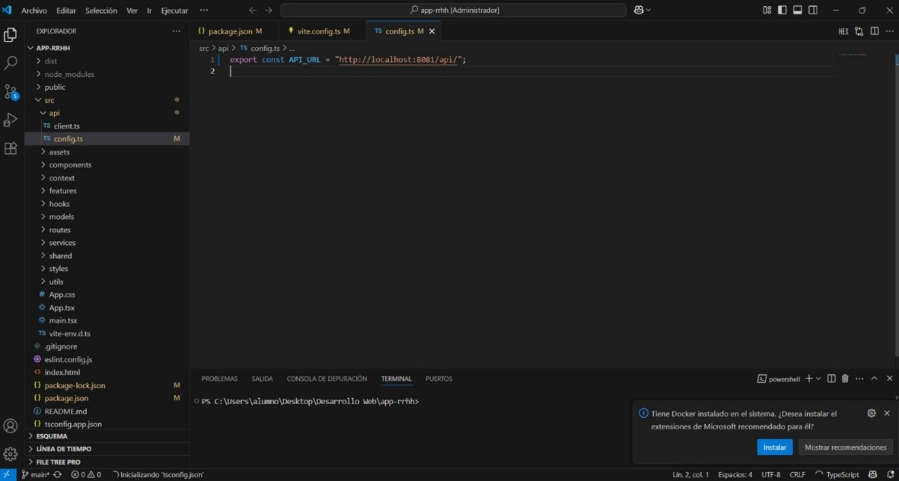
2. Crear carpeta `C:\inetpub\app-rrhh`.
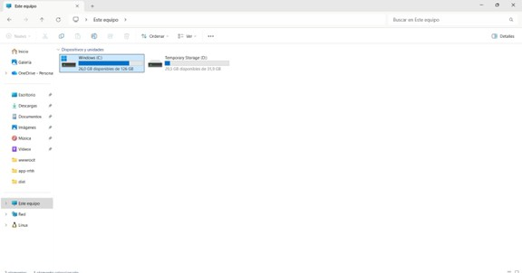
3. Copiar el contenido de `/dist` dentro de esa carpeta.
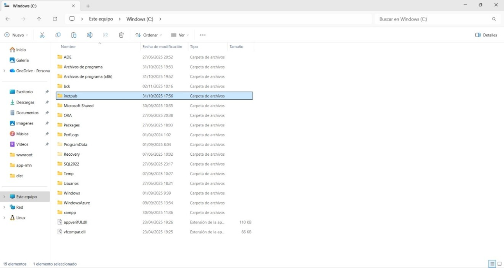
4. Crear sitio web en IIS:

   * Nombre: rrhh.
   * Ruta física: `C:\inetpub\app-rrhh`.
   * Puerto: 8081.
   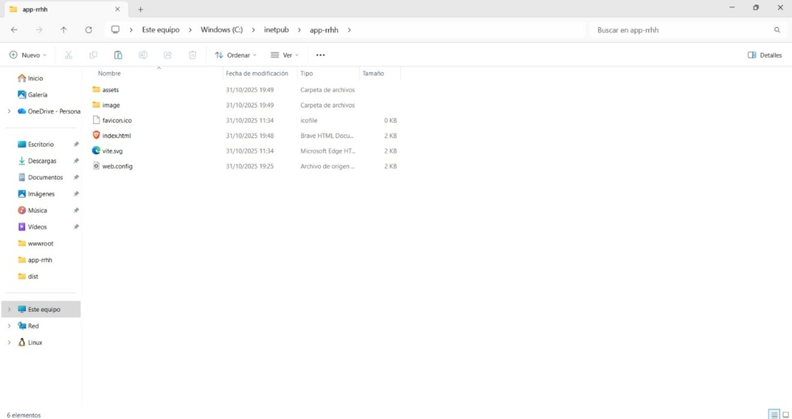
5. Crear `web.config` con el siguiente contenido:
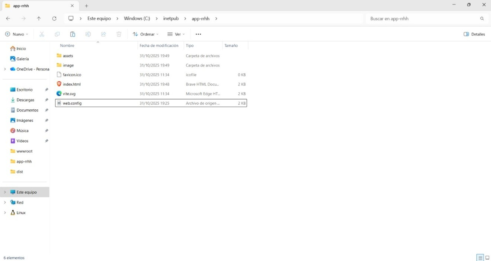
```xml
<configuration>
  <system.webServer>
    <rewrite>
      <rules>
        <rule name="ReactRoutes">
          <match url=".*" />
          <action type="Rewrite" url="index.html" />
        </rule>
      </rules>
    </rewrite>
    <staticContent>
      <mimeMap fileExtension=".js" mimeType="text/javascript" />
      <mimeMap fileExtension=".json" mimeType="application/json" />
    </staticContent>
  </system.webServer>
</configuration>
```

---

## Diseño y Módulos del Sistema

### Módulo Empleados

* CRUD completo (crear, listar, editar, desactivar/activar).
* Validaciones de DPI, correo y teléfono.
* Solo RRHH/Admin pueden modificar datos.

### Módulo Departamentos y Puestos

* Mantenimiento de catálogos.
* Reglas de integridad referencial (no borrar si hay empleados asociados).

### Módulo Nómina

* Cálculo de devengado, descuentos y neto.
* Exportación a PDF y CSV.
* Cierre y reapertura de periodos.

### Módulo Reportes

* Reportes por empleado, periodo y departamento.
* Filtros y exportaciones personalizadas.

### Módulo Usuarios

* Autenticación JWT.
* CRUD de usuarios (solo Admin).
* Asignación de roles: **Administrador**, **RRHH**, **Empleado**.

---

## Diagrama Entidad-Relación

```text
[Empleados]───┬───< pertenece a >───[Departamentos]
              │
              ├───< ocupa >──────────[Puestos]
              │
              └───< tiene >──────────[Formación]

[Nominas]───< contiene >───[DetallesNomina]
[Usuarios]───< registra >───[Bitacora]
```

📊 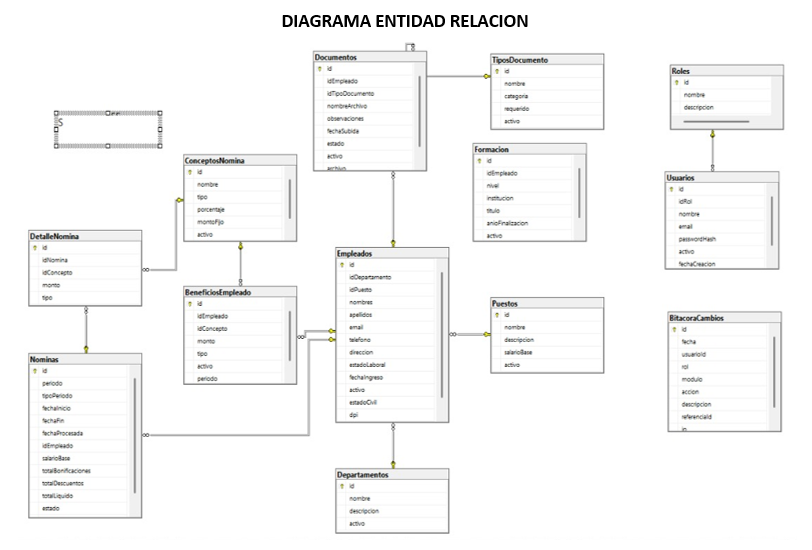

---

## Endpoints Disponibles

* `/api/auth/login` → Autenticación JWT.
* `/api/empleados` → CRUD de empleados.
* `/api/departamentos` → Mantenimiento de departamentos.
* `/api/puestos` → Mantenimiento de puestos.
* `/api/nominas` → Gestión y cálculo de nómina.
* `/api/reportes` → Generación de reportes PDF/CSV.
* `/api/usuarios` → Gestión de usuarios y roles.

---

## Autenticación y Autorización (JWT + Roles)

El sistema utiliza **JSON Web Tokens (JWT)** para autenticar usuarios.

**Roles definidos:**

* **Administrador:** Acceso total al sistema.
* **RRHH:** Gestión de empleados, nóminas y reportes.
* **Empleado:** Lectura de su perfil y comprobantes.

El backend implementa middlewares de verificación de token y rol; el frontend protege rutas con guards (`PrivateRoute`).

---

## Gestión de Sesiones

* **Almacenamiento:** LocalStorage seguro.
* **Expiración:** tokens con tiempo definido (`exp`).
* **Cierre de sesión:** eliminación del token y redirección al login.

---

## Mantenimiento Preventivo

### Actualizaciones

```bash
npm update
npm audit fix
```

* Ejecutar mensualmente en backend y frontend.
* Verificar vulnerabilidades.

### Limpieza del entorno

```bash
rmdir /s /q node_modules
del /f /q package-lock.json
npm cache clean --force
```

### Verificación de base de datos

* Ejecutar `DBCC CHECKDB` desde SSMS.
* Respaldar semanalmente la base `db_nomina`.

### Seguridad

* Revisar expiración de certificados SSL.
* Rotar contraseñas administrativas.
* Revisar orígenes CORS permitidos.

---

## Diagrama de Casos de Uso

```text
                +-----------------------------+
                |        Sistema RRHH         |
                +-----------------------------+
                   ^          ^           ^
                   |          |           |
           [Empleado]   [RRHH]     [Administrador]

Empleado → Consulta de perfil y comprobante.
RRHH → Gestiona empleados, nóminas, reportes.
Administrador → Gestiona usuarios y configuraciones.
```

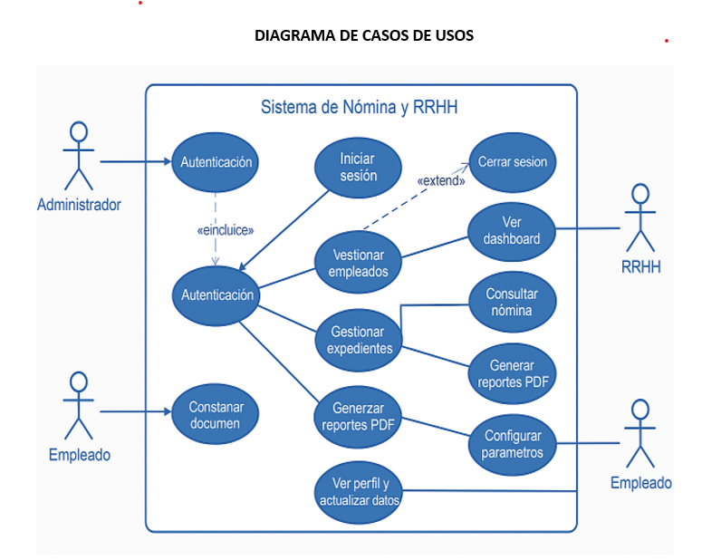

---

## Autor

👨‍💻 **Pablo Raúl Arreola Contreras y Marvin Alexander**
Universidad Mariano Gálvez de Guatemala
Proyecto: *Sistema de Nómina y Gestión de Recursos Humanos (2025)*
