# Manual de Usuario del Sistema de Nómina y RRHH

## Introducción
El presente manual de usuario describe de forma detallada el funcionamiento del **Sistema de Nómina y Gestión de Recursos Humanos**, desarrollado con tecnologías modernas e implementado en un entorno IIS.  
Su propósito es guiar al usuario final en la correcta utilización de las funciones principales del sistema, diferenciando los accesos y acciones disponibles según el **rol asignado** (Administrador o Recursos Humanos).

---

## Acceso al Sistema
Para ingresar al sistema, utiliza tu **correo electrónico** y **contraseña** asignados por el administrador.  
Si tienes inconvenientes, presiona el enlace **“¿Necesitas ayuda?”** en la pantalla de inicio de sesión.

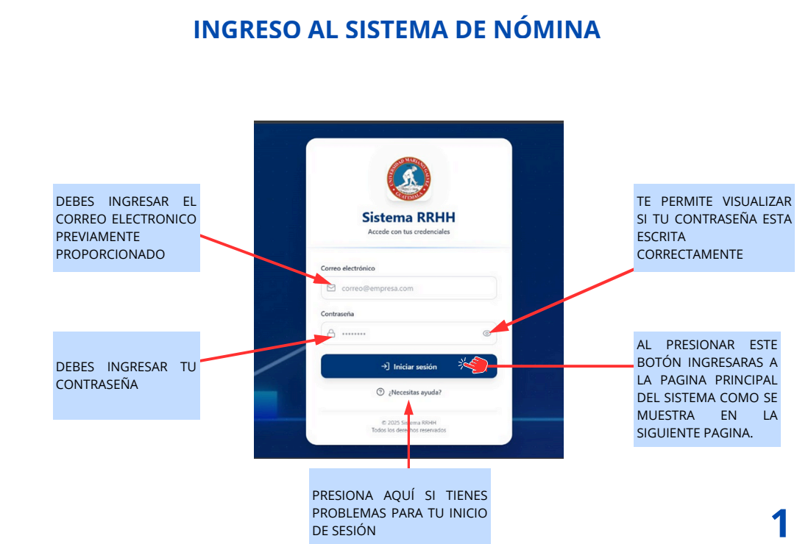

Una vez autenticado, accederás al **panel principal** con los módulos disponibles de acuerdo con tu rol.

---

## Manual de Usuario con el Rol de Administrador

### Pantalla Principal
El usuario con rol **Administrador** tiene acceso completo a todos los módulos del sistema.
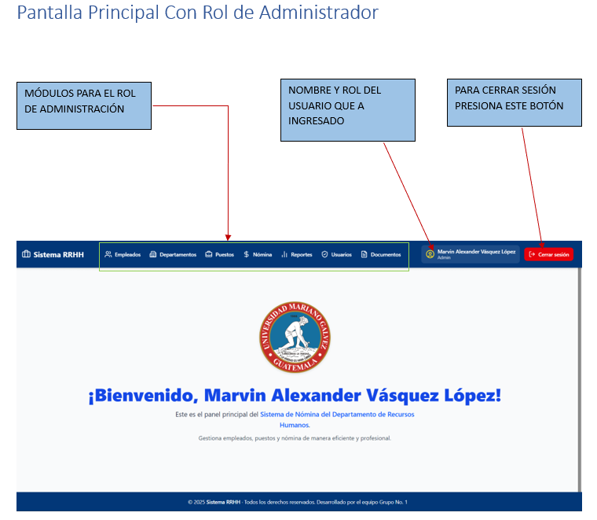
**Módulos disponibles:**
- Empleados  
- Departamentos  
- Puestos  
- Nóminas  
- Reportes  
- Usuarios  

En la parte superior se visualiza el **nombre y rol del usuario**, además del botón **Cerrar Sesión**.

---

### Módulo Empleados
Permite administrar la información general del personal.

#### Crear un nuevo empleado
1. Presiona el botón **Nuevo Empleado**.  
2. Completa los campos requeridos: nombres, apellidos, DPI, correo, teléfono, dirección, departamento y puesto.  
3. Presiona **Crear Empleado**.  

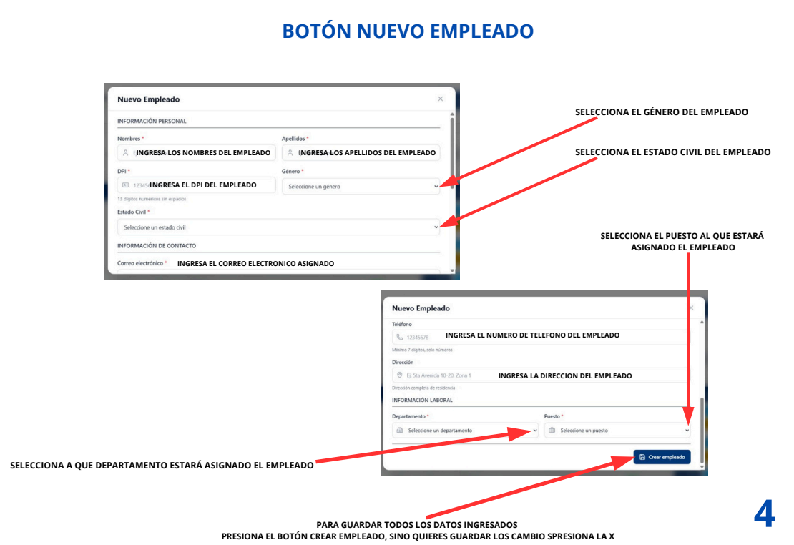

#### Búsqueda y filtros
- **Todos:** muestra empleados activos e inactivos.  
- **Activos:** solo los empleados activos.  
- **Inactivos:** empleados dados de baja temporal.  

#### Estado del empleado
- Para **inactivar** un empleado, presiona el botón rojo y confirma la acción.  
- Para **activar** nuevamente, presiona el botón verde y confirma.  

#### Perfil y formación
Desde el perfil puedes consultar:
- Información personal.  
- Formación académica.  
- Documentos asociados.  

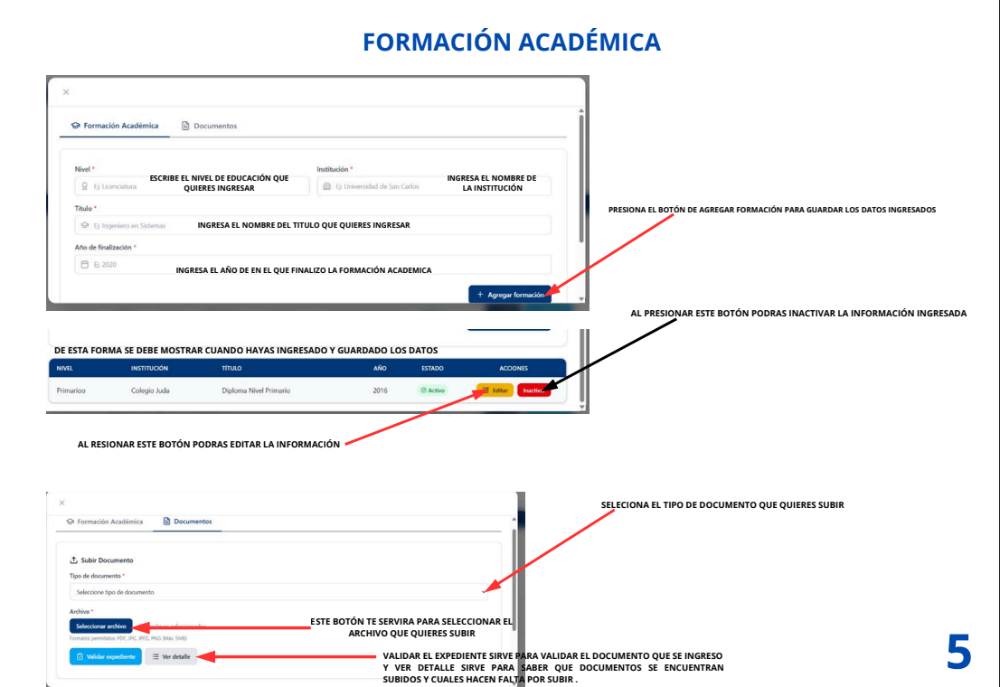

#### Documentos del empleado
1. Selecciona el tipo de documento.  
2. Presiona **Seleccionar archivo** y elige el documento.  
3. Valida el expediente con el botón **Validar expediente**.  
4. Puedes ver los documentos cargados o inactivarlos según sea necesario.

---

### Módulo Departamentos
Permite crear, editar y eliminar departamentos.

- Para crear un nuevo departamento, presiona **Nuevo Departamento**, completa los campos y confirma con **Crear**.  
- Usa la barra de búsqueda para filtrar departamentos.  
- Para editar, actualiza los datos y guarda los cambios.  

---

### Módulo Puestos
Administra los cargos o posiciones dentro de la empresa.

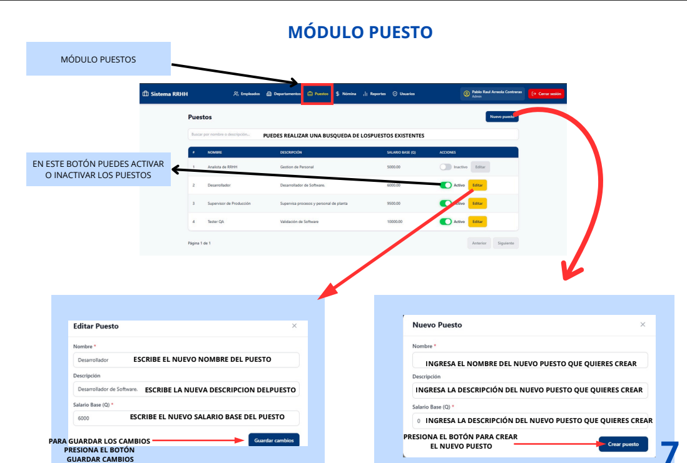

- Para crear un nuevo puesto, presiona **Nuevo Puesto**.  
- Define nombre, descripción y salario base.  
- Puedes activar o inactivar puestos según disponibilidad.  

---

### Módulo Nóminas
Permite procesar las planillas generales e individuales.

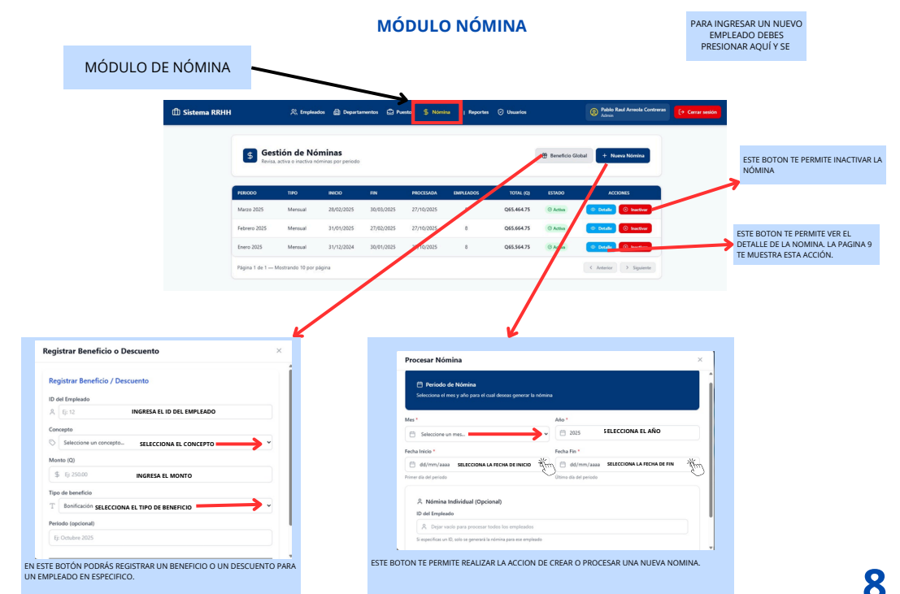

#### Crear una nómina general
1. Presiona **Nueva Nómina**.  
2. Completa la información del período.  
3. Presiona **Procesar General**.  
4. Confirma la generación de nómina.  

> ⚠️ No se puede crear una nueva nómina general si ya existe una activa para el mismo período.

#### Crear una nómina individual
1. Presiona **Nueva Nómina**.  
2. Completa los campos e ingresa el **ID del empleado**.  
3. Presiona **Generar Individual**.  
4. Confirma la generación.  

> ⚠️ No se puede crear una nómina individual si ya existe una activa para el mismo empleado en el mismo período.

#### Bonificaciones y descuentos
Presiona el botón **Bonos o Descuentos**, completa los campos y guarda.  
El sistema mostrará una confirmación de registro exitoso.

#### Detalle de nómina
Permite visualizar el detalle de pago de cada empleado.  
Puedes exportar el detalle en **PDF** o **Excel**.  

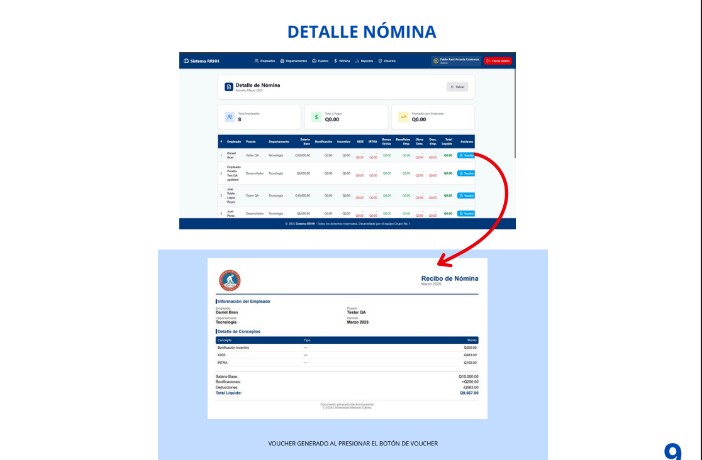

#### Inactivar una nómina
Presiona el botón **Inactivar** y confirma.  
El sistema mostrará el cambio de estado a inactiva.

---

### Módulo Reportes
Administra reportes generales y por documentos.

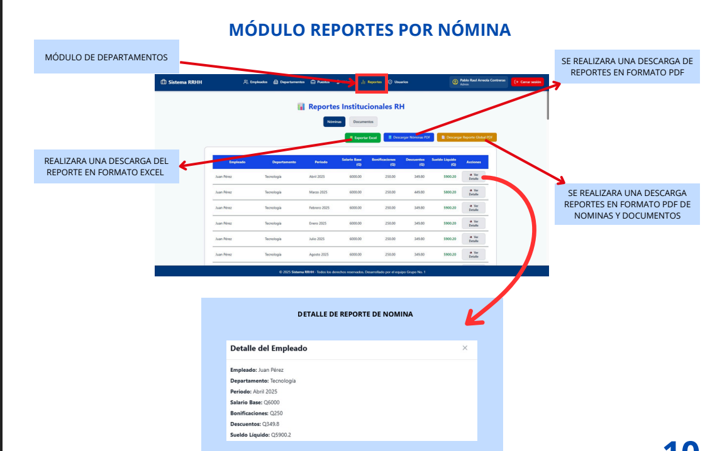

#### Reporte de nóminas
- **Exportar Excel:** presiona **Exportar Excel**.  
- **Descargar PDF:** presiona **Descargar Nómina PDF**.  
- **Reporte Global:** presiona **Descargar Reporte Global PDF**.  

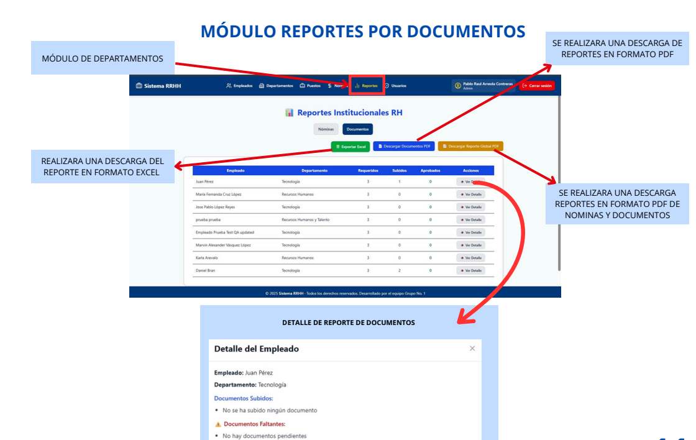

#### Reporte de documentos
- Lista empleados con documentos cargados o pendientes.  
- Exporta en Excel o PDF global.  

---

### Módulo Usuarios
Gestión completa de usuarios del sistema.

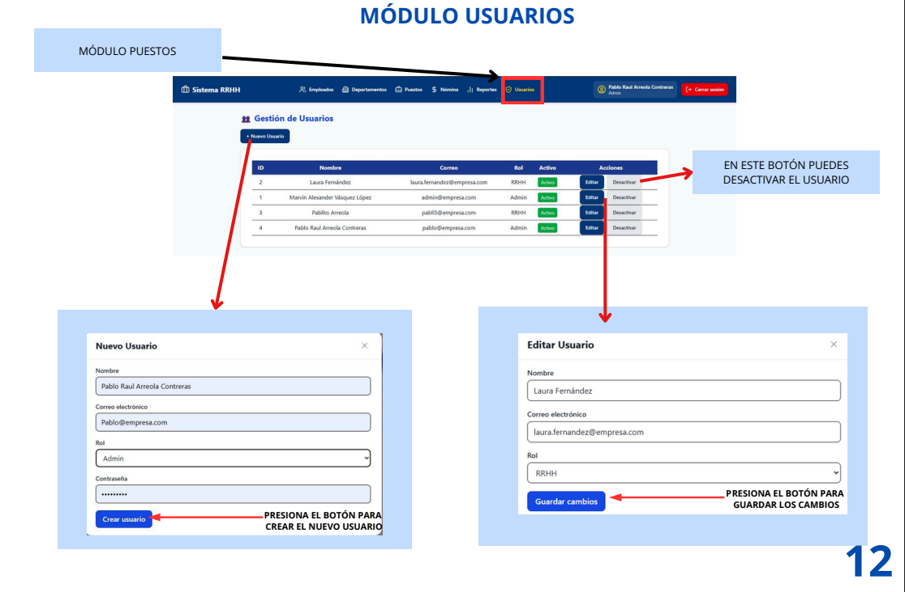

- **Crear usuario:** completa los campos requeridos y presiona **Crear Usuario**.  
- **Editar usuario:** modifica los campos y guarda cambios.  
- **Desactivar usuario:** presiona **Desactivar Usuario** y confirma.  

---

## Manual de Usuario con el Rol de Recursos Humanos

### Pantalla Principal
El rol de **Recursos Humanos (RRHH)** tiene acceso a los módulos de:
- Empleados  
- Departamentos  
- Puestos  
- Nóminas  
- Reportes  

El usuario visualiza su nombre y rol, y puede cerrar sesión desde la barra superior.

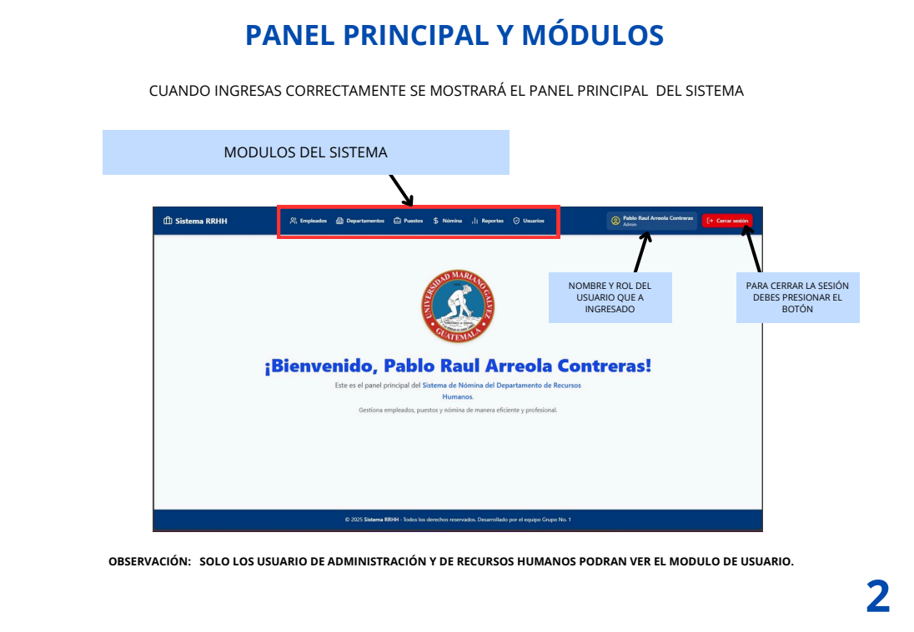

---

### Módulo Empleados
Permite administrar la información del personal y sus documentos.  

#### Crear un nuevo empleado
1. Presiona **Nuevo Empleado**.  
2. Completa todos los campos requeridos.  
3. Presiona **Crear Empleado** para guardar.  

#### Buscar empleados
Usa la barra superior para buscar por nombre, apellido, correo o DPI.  
Los filtros disponibles son **Todos**, **Activos**, **Inactivos**.  

#### Cambiar estado
- Presiona el botón rojo para inactivar.  
- Presiona el botón verde para activar.  
El sistema mostrará mensajes de confirmación en cada caso.  

#### Formación Académica y Documentos
Agrega nuevas formaciones, edita información o cambia estado (Activo/Inactivo).  
Sube documentos válidos y verifica el estado del expediente.

---

### Módulo Departamentos
Crea y administra los departamentos de la organización.

1. Presiona **Nuevo Departamento**.  
2. Llena los campos requeridos.  
3. Presiona **Crear** y confirma.  

Puedes buscar, editar o eliminar departamentos según necesidad.

---

### Módulo Puestos
Permite gestionar los cargos disponibles.  

1. Presiona **Nuevo Puesto**.  
2. Completa los campos con nombre, descripción y salario.  
3. Guarda y confirma.  

Puedes activar o inactivar puestos según su disponibilidad.

---

### Módulo Nóminas
Desde este módulo se procesan las nóminas generales o individuales.

1. Presiona **Nueva Nómina**.  
2. Completa los campos del formulario.  
3. Elige si procesar general o individual.  
4. Guarda y confirma.

Puedes agregar bonificaciones o descuentos y exportar los reportes correspondientes.

---

### Módulo Reportes
Accede a reportes por nómina o por documentos.

- **Exportar Excel** o **Descargar PDF** de nóminas.  
- **Reporte Global PDF** para consolidar toda la información.  

---

## Seguridad y Cierre de Sesión
Para salir del sistema, presiona el botón **Cerrar Sesión** ubicado en la parte superior derecha del panel.  
Esto garantiza la protección de tus datos y evita accesos no autorizados.

---

## Soporte Técnico
Si tienes inconvenientes con el sistema, comunícate con el **administrador del sistema** o el **departamento de informática** para recibir asistencia.

---

## Autor
👨‍💻 **Pablo Raúl Arreola Contreras y Marvin Alexander**  
Universidad Mariano Gálvez de Guatemala  
Proyecto: *Sistema de Nómina RH — 2025*
